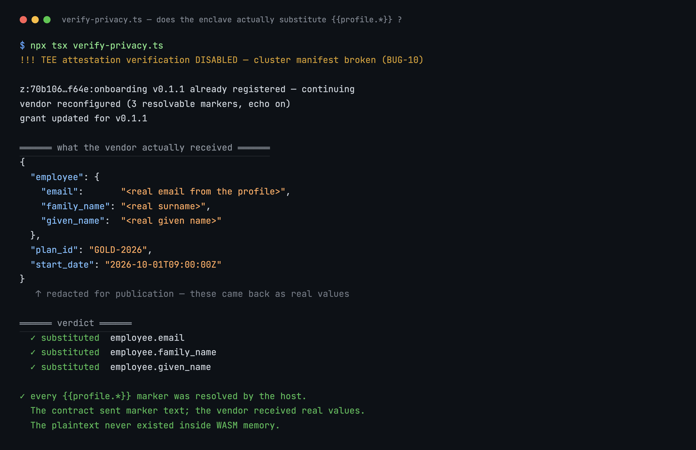

# z-tenant-onboarding

An employee-onboarding agent for Terminal 3, built for the **T3N Agent Build Challenge**.

It enrols one employee into the third-party HR systems a company uses — benefits, background check,
payroll, equipment, SaaS seats — **without the contract, the agent, or any log in between ever holding
the employee's personal data**.

Verified end-to-end on testnet. The privacy claim is not asserted; it is measured — see
[Proof](#proof-the-privacy-property-measured-not-claimed).

---

## The problem

Onboarding one person means giving the same handful of personal details to five or six vendors. Today
someone re-keys them into each vendor's portal, so the employee's name, date of birth and email end up
copied across mailboxes, spreadsheets and vendor dashboards. Nobody can answer "which vendors hold Jane's
data, and who sent it there?", and the employee has no way to revoke it.

Handing that job to an AI agent normally makes it worse: now the PII is in a model's context window too.

## What this does instead

The enrolment body is a template full of `{{profile.*}}` markers. The contract sends the *markers*. The
host resolves them from the calling employee's profile **inside the enclave**, immediately before the
outbound request. WASM memory only ever contains marker text.

```
  agent ──► z:<tid>:onboarding ─────────────► host (http-with-placeholders) ──► vendor
            builds body with                  resolves {{profile.*}} from        receives
            {{profile.first_name}}             the employee's profile,           real values
            …never sees a real value           inside the enclave
```

Three properties fall out of that:

- **The employee controls it.** No grant, no enrolment. Egress is authorised per-call by the employee's
  own delegation, scoped to specific functions and specific vendor hosts. Revoking is one write.
- **It is auditable.** Every dispatch is an audit row. The contract's own logs record *which* markers
  were used, never their values — so an operator can answer "what did we send this vendor?" without the
  log itself becoming another copy of the PII.
- **Adding a vendor doesn't touch the code.** See below.

## Vendors are data, not code

Every company onboards into a different set of vendors, and that set changes far more often than anyone
wants to redeploy a TEE contract. So vendors live in the KV map `z:<tid>:onboarding-providers`, one JSON
document each:

```json
{
  "name": "Acme Benefits",
  "url": "https://api.acme-benefits.example/v1/enrollments",
  "method": "POST",
  "secret_key": "acme_benefits_api_key",
  "auth_header": "Authorization",
  "auth_format": "Bearer {key}",
  "headers": [["Accept", "application/json"]],
  "body": {
    "employee": {
      "given_name":  "{{profile.first_name}}",
      "family_name": "{{profile.last_name}}",
      "email":       "{{profile.verified_contacts.email.value}}"
    },
    "plan_id":    "{{field.plan_id}}",
    "start_date": "{{field.start_date}}"
  }
}
```

**Adding a vendor is one map write.** No Rust change, no `cargo build`, no re-registration, no new
contract version to re-authorise in every employee's delegation grant. That last one matters most: a
code change would invalidate `version_req` in existing grants and require every employee to re-consent.

Two marker namespaces, deliberately separated:

| Namespace | Who fills it | Where it is resolved |
|---|---|---|
| `{{profile.*}}` | the host | inside the enclave, from the employee's profile |
| `{{field.*}}` | the caller | inside the contract — **non-personal values only** |

### The PII guard

`{{field.*}}` is the only channel a caller can write into, which makes it the one way to route PII around
the enclave. If a caller could pass `"given_name": "Jane Smith"`, the plaintext would sit in contract
memory, in the agent's context, and in every log between them — and **it would still work**. Nothing
would fail; the guarantee would just quietly be gone.

So `enroll::assert_no_pii` rejects caller values that look personal, on two independent axes — field
name and value shape — so renaming a field to dodge the name check still trips the value check:

```
enroll(provider_id="demo-benefits", fields={plan_id:"GOLD-2026", employee_email:"jane@example.com"})

→ contract error: field 'employee_email' looks like personal data (matched 'email').
  Personal data must not be passed as an argument — put a {{profile.<field>}} marker in the
  provider template so the host resolves it inside the enclave.
```

Ordinary operational values (`plan_id`, `cost_centre`, `headcount`, ISO timestamps) pass untouched;
that separation is covered by tests.

## Functions

| Function | Purpose |
|---|---|
| `list-providers` | Enumerate configured vendors. Returns each vendor's `required_fields` (the `{{field.*}}` it expects) and `profile_fields` (the PII it will receive) — the latter surfaced deliberately, so an operator can audit what each vendor gets. Carries no secrets. |
| `enroll` | Enrol the calling employee into one vendor. |

`list-providers` exists so an agent can discover what it can do at runtime instead of carrying a
hardcoded vendor list in its prompt — a prompt that would go stale the moment someone adds a vendor.

---

## Screenshots

| | |
|---|---|
| [Privacy property verified](screenshots/01-privacy-verified.png) | The decisive echo test — every `{{profile.*}}` resolved by the host |
| [Contract behaviour](screenshots/02-contract-behaviour.png) | `list-providers`, the PII guard firing, and TEE-side logs |
| [Profile schema probe](screenshots/03-profile-schema-probe.png) | Which markers actually resolve — and the two the official samples get wrong |
| [BUG-10, the blocker](screenshots/04-bug10-blocker.png) | No environment can complete a verified handshake |
| [Tests and build](screenshots/05-tests-and-build.png) | 20 tests, zero warnings, component interface |



## Proof: the privacy property, measured not claimed

Bring-up used `httpbin.org/post` as the vendor, because it echoes the request body back. That makes the
property directly observable rather than assumed: if the enclave substitutes the markers the echo shows
real values; if it does not, the echo shows the literal `{{profile.…}}` text.

`app/verify-privacy.ts` output (personal values redacted here; unredacted in the run):

```json
{
  "employee": {
    "email":       "<real email from the profile>",
    "family_name": "<real surname>",
    "given_name":  "<real given name>"
  },
  "plan_id": "GOLD-2026",
  "start_date": "2026-10-01T09:00:00Z"
}
```

> Redacted here because they are the profile owner's actual details. That is
> precisely the point: the contract sent `{{profile.first_name}}`, and the vendor
> received a real name. The two non-PII values passed through as themselves.

```
✓ substituted  employee.email
✓ substituted  employee.family_name
✓ substituted  employee.given_name

✓ every {{profile.*}} marker was resolved by the host.
  The contract sent marker text; the vendor received real values.
  The plaintext never existed inside WASM memory.
```

The contract's log line from the same call — note it names the markers, never the values:

```
[info] enroll: provider=demo-benefits url=https://httpbin.org/post
       profile_markers=["verified_contacts.email.value", "last_name", "first_name"]
```

> Turn `echo_response` off for real vendors. It exists for bring-up against an echo endpoint; a genuine
> vendor response may itself contain personal data, and returning it to the caller would put that data
> into the agent's context — the exact thing this contract exists to avoid.

---

## Run it

Prerequisites: Node ≥ 22, Rust with the `wasm32-wasip2` target, a T3N API key.

```bash
rustup target add wasm32-wasip2

# 1. build the contract
cd z-tenant-onboarding
cargo test                                     # 20 tests, no cluster needed
cargo build --target wasm32-wasip2 --release

# 2. deploy: register, create maps, seed a vendor
cd ../app
npm install
set -a && . ../.secrets/t3n.env && set +a      # T3N_API_KEY=0x…
npx tsx deploy.ts                              # note the contract_id it prints

# 3. authorise egress (self-grant) and enrol
npx tsx grant-and-enroll.ts

# 4. verify the privacy property
npx tsx verify-privacy.ts
```

| Script | What it does |
|---|---|
| `connect.ts` | Authenticate; print the tenant DID and every host the SDK contacts |
| `deploy.ts` | Register the contract, create both maps, seed the demo vendor |
| `invoke.ts` | Exercise `list-providers`, the PII guard, and `enroll`; dump contract logs |
| `grant-and-enroll.ts` | Write the self-grant, then run a real enrolment |
| `verify-privacy.ts` | The decisive echo test above |
| `probe-profile-schema.ts` | Discover which `{{profile.*}}` markers this cluster can resolve |
| `fix-map-acl.ts` | Re-point map ACLs after a re-registration (see BUG-13) |

### `probe-profile-schema.ts` is worth keeping

The user-profile schema is not documented anywhere — not on the placeholders page, not in the SDK
reference, not in the OpenAPI spec (BUG-06). We wrote this probe because we had to, and it is the only
way we know of to answer "which markers can I use?". Measured on testnet, 2026-09-10:

| Marker | Result |
|---|---|
| `first_name` | ✅ resolves |
| `last_name` | ✅ resolves |
| `verified_contacts.email.value` | ✅ resolves |
| `date_of_birth` | ❌ **absent** — but used by the docs *and* `z-tenant-flight` |
| `gender` | ❌ **absent** — but used by `z-tenant-flight` |
| `middle_name`, `full_name`, `display_name`, `email`, `phone` | ❌ absent |

---

## Findings

[`findings/BUGS.md`](findings/BUGS.md) — 14 issues found while building this, each with the source, a
reproduction, why it matters, and a suggested fix. The ones we'd action first:

| # | Finding | Severity |
|---|---|---|
| **10** | **Testnet's trust manifest omits `rtmr1_allowlist`/`sev_snp_measurement_allowlist`, so `fetchTrustedManifest` fails on every environment — nobody can complete the Quickstart on the verified path** | **Blocker** |
| **12** | The flagship `z-tenant-flight` example uses two profile fields that don't exist, so `book-offer` cannot succeed | High |
| **6** | The user-profile schema is published nowhere, so `{{profile.*}}` can only be used by guessing | High |
| **8** | The placeholder page's only code sample has two type errors and a duplicate `Content-Type` | High |
| **5** | The SDK ships fully obfuscated and its declared source repository 404s, while holding an Ethereum private key | High |
| **3** | The walkthrough's `world.wit` pins host-interface versions that don't exist in the reference repo | High |
| 13 | Re-registering a contract silently invalidates its map ACLs | Med–High |
| 1, 4, 7, 9, 11, 14 | Duplicate object keys in the AI-assistant skill file; a missing `hex` dependency; a stale manifest instruction contradicting three doc pages; WIT/doc disagreement on who authorises egress; `sandbox` aliasing `testnet`; undocumented `fuel_per_minute` quota and non-idempotent registration | Low–Med |

### One deviation from the documentation, stated plainly

`app/*.ts` pass `trustAnchor: { unsafe_trust_server: true }` instead of `fetchTrustedManifest(env)`.

That is **not** a shortcut and not our preference — it is BUG-10. The verified path is impossible right
now: the cluster serves a manifest this SDK version rejects, on every environment. The documentation is
explicit that the opt-out is for local dev nodes and that you must never silently substitute it after a
verification failure, so ours is **not** in a `catch`: it is unconditional, commented at the call site,
and logged loudly on every run. It will be reverted the moment the cluster publishes a conforming
manifest. Blast radius: a sandbox key with test credits and no real assets.

---

## Maintenance and handover

Built to be handed over. In the sponsor's words — *"usefulness & ease of maintenance & running post
challenge"* — here is what running it actually costs.

**Routine changes need no engineer:**

| Task | How | Redeploy? |
|---|---|---|
| Add / change / remove a vendor | one `map-entry-set` write | no |
| Rotate a vendor API key | one `map-entry-set` into `secrets` | no |
| Change which PII a vendor receives | edit that vendor's `body` template | no |
| Onboard a new employee | they sign one delegation grant | no |
| Revoke a vendor or an agent | update the grant | no |

**Changes that do need a rebuild:** a new host capability (a new `world.wit` import), a change to the
PII-guard rules, or a new contract function. After any re-registration, run `fix-map-acl.ts` with both
the old and new contract ids — see BUG-13.

**Operational notes**
- Contract logs are off by default (`log_max_entries` quota is 0). Ours emit marker names only and are
  safe to enable.
- Calls are rate-limited per minute (`fuel_per_minute`), which is undocumented — batch enrolments should
  pace themselves. See BUG-14a.
- `deploy.ts` is idempotent apart from `contracts.register`, which requires a strictly increasing
  version; `verify-privacy.ts` shows the catch-and-continue pattern.

**We are happy either way** — to keep running and extending it, or to hand it over. If handed over, the
whole system is this repository: one Rust crate, six TypeScript scripts, no infrastructure, no database,
no hosted component. The only state is two KV maps and the employees' delegation grants, all of which
live on T3N rather than with us.

**The obvious next step**, if this is kept: the vendor templates and the PII guard are the two things a
non-Rust operator will want to change most, and both are already data-shaped. A small admin UI over
`map-entry-set` would let an HR ops team add a vendor without touching a terminal.

## Layout

```
z-tenant-onboarding/       the TEE contract (Rust → WASM component)
  src/lib.rs               bindings + dispatch
  src/registry.rs          vendor config: load, parse, marker extraction
  src/enroll.rs            PII guard, template rendering, dispatch
  wit/world.wit            exported interface + host imports
app/                       TypeScript: deploy, invoke, verify, probe
findings/BUGS.md           14 findings
docs/                      offline snapshot of the T3N docs used
```

## Licence

MIT.
